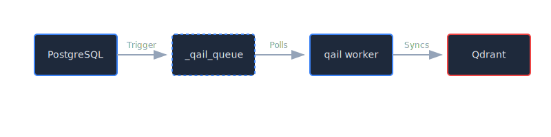

# Hybrid Architecture

QAIL bridges the gap between relational data (PostgreSQL) and vector search (Qdrant) using a robust **Outbox Pattern**.

## Overview

Instead of dual-writing to both databases (which is prone to inconsistencies), QAIL uses a transactional outbox approach:

1.  **Transactional Write:** You write to your PostgreSQL tables.
2.  **Auto-Trigger:** A database trigger captures the change and writes a "sync event" to the `_qail_queue` table *in the same transaction*.
3.  **Async Worker:** The `qail worker` daemon polls the queue and reliably syncs data to Qdrant.



## Setup

### 1. Initialize Hybrid Project

```bash
qail init
# Select "3. Hybrid (PostgreSQL + Qdrant)" when prompted
```

This creates a `migrations/001_qail_queue.up.qail` file defining the `_qail_queue` table.

### 2. Configure Sync Rules

Define which tables should sync to Qdrant in `qail.toml`:

```toml
[[sync]]
source_table = "products"           # Table to watch
trigger_column = "description"      # Only sync if this column changes (optional optimization)
target_collection = "products_search" # Qdrant collection name
embedding_model = "candle:bert-base"  # (Coming soon)
```

### 3. Generate Triggers

Run the command to generate PostgreSQL triggers based on your rules:

```bash
qail sync generate
# Creates migrations/002_qail_sync_triggers.up.qail
```

This generates triggers that:
-   **INSERT:** Adds `UPSERT` event to queue.
-   **UPDATE:** Adds `UPSERT` event (only if `trigger_column` changed).
-   **DELETE:** Adds `DELETE` event to queue.

### 4. Apply Migrations

Apply the migration files to your database:

```bash
qail migrate apply
```

### 5. Start Worker

Start the background worker to process the queue:

```bash
qail worker
```

## Resilience

The `qail worker` is designed for production reliability:

-   **At-Least-Once Delivery:** Events are only removed from the queue after successful sync to Qdrant.
-   **Circuit Breaker:** If Qdrant goes down, the worker pauses and retries with exponential backoff (up to 30s).
-   **Per-Item Error Handling:** A single reduced item won't crash the worker; it will be marked with an error and retried later.
-   **Batch Processing:** Updates are sent to Qdrant in batches for high throughput.

## The `_qail_queue` Table

| Column | Type | Description |
|---|---|---|
| `id` | SERIAL | Sequence ID for ordering |
| `ref_table` | TEXT | Source table name |
| `ref_id` | TEXT | Primary key of the source row |
| `operation` | TEXT | `UPSERT` or `DELETE` |
| `payload` | JSONB | Full row data (snapshot) |
| `status` | TEXT | `pending`, `processing`, `failed` |
| `retry_count` | INT | Number of failed attempts |
| `error_message` | TEXT | Last error message |
